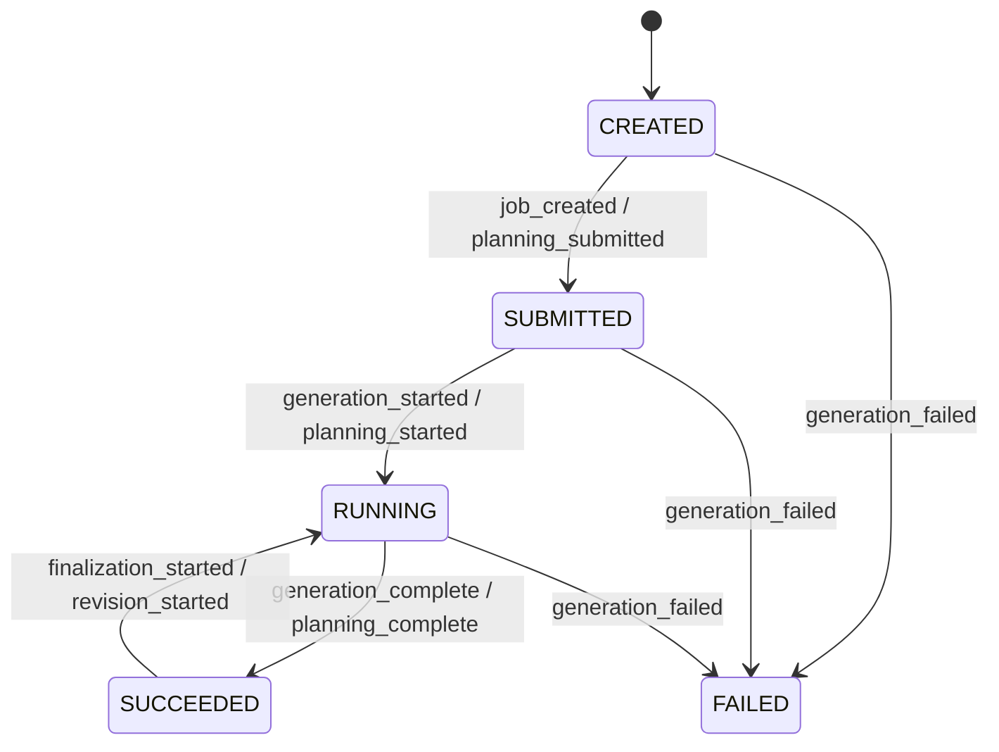
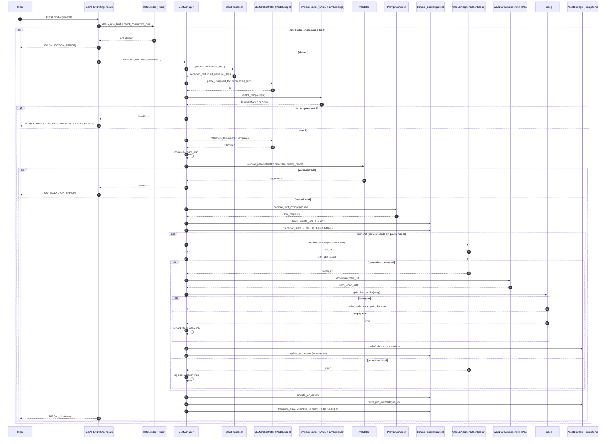
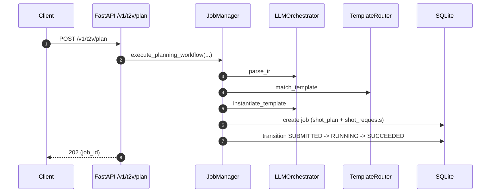
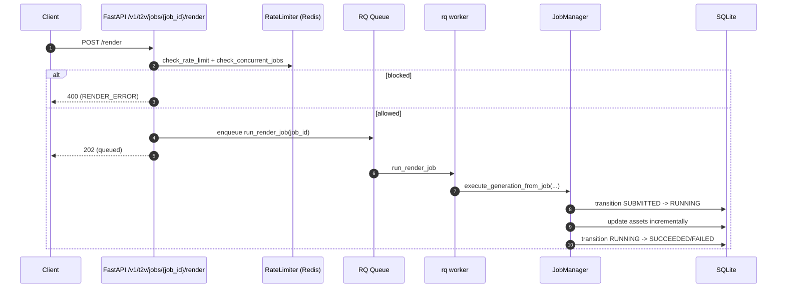
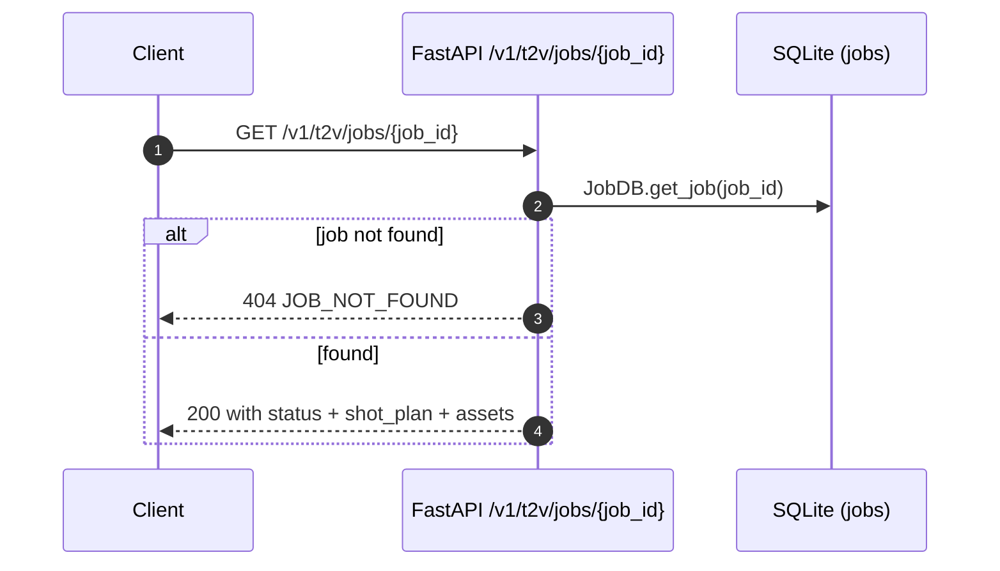
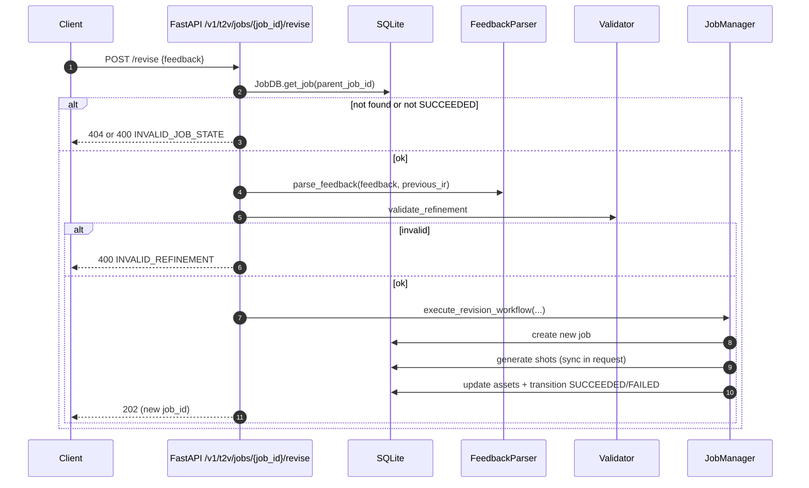
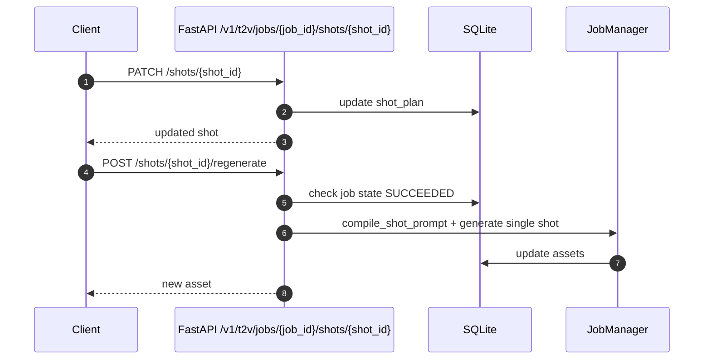
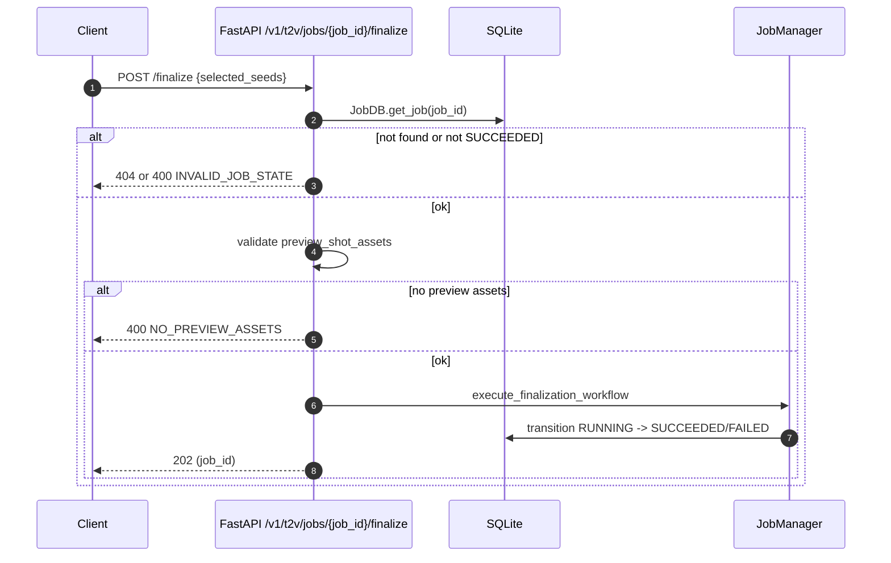

# Backend Data Flow (Input to Output)

This document describes the current backend data flow based on the FastAPI service
implementation. It includes sequence diagrams, flowcharts, data stores, external
dependencies, and error branches.

## Scope

- Primary flows:
  - `POST /v1/t2v/generate` (synchronous full generation)
  - `POST /v1/t2v/plan` + `POST /v1/t2v/jobs/{job_id}/render` (recommended async path)
- Support flows: `GET /v1/t2v/jobs/{job_id}`, `POST /v1/t2v/jobs/{job_id}/revise`,
  `POST /v1/t2v/jobs/{job_id}/finalize`, shot update/regenerate
- Data stores: `jobs` and `templates` tables, filesystem static assets
- External services: LLM, embeddings, DashScope video, Redis, ffmpeg, RQ worker

Note: `POST /v1/t2v/generate` executes the full workflow inside the request and
returns after generation completes (still with HTTP 202).

## Data Stores

- SQLite database (default `sqlite:///./data/jobs.db`)
  - `jobs` table (see `backend/src/models/job.py`)
    - Inputs: `user_input_redacted`, `user_input_hash`, `pii_flags`
    - Pipeline: `ir`, `shot_plan`, `shot_requests`
    - Outputs: `shot_assets` (may include multiple candidates per shot),
      `preview_shot_assets` (currently not written), `selected_seeds`,
      `resolution`, `total_duration_s`
    - Lifecycle: `state`, `state_transitions`, timestamps
    - Errors: `error_details`, retry fields
  - `templates` table (see `backend/src/models/template.py`)
    - `template_id`, `version`, `tags`, `constraints`, `shot_skeletons`,
      `negative_prompt_base`
- Filesystem static storage
  - Default: `/var/lib/prism/static`, fallback to `backend/data`
  - Subdirs: `vedios/`, `audio/`, `metadata/` (note spelling `vedios`)

## External Dependencies

- ModelScope Qwen LLM (IR parsing, template instantiation, feedback parsing)
  - `LLMOrchestrator` and `FeedbackParser`
- DashScope embeddings (template semantic search)
  - `TemplateRouter` + FAISS index
- DashScope Wan2.6 text-to-video API
  - `Wan26RetryAdapter` submit/poll
- Redis
  - Rate limiting and concurrent job tracking
  - RQ queue for `/render` async jobs
- HTTP download (httpx)
  - Download generated videos from DashScope URL
- ffmpeg/ffprobe
  - Split video into video-only and audio-only outputs

## State Transitions

## Sequence Diagram: Generate Flow (Sync)

## Sequence Diagram: Plan + Render (Async)

## Sequence Diagram: Job Status Query

## Sequence Diagram: Revision Flow (Sync)

## Sequence Diagram: Shot Update / Regenerate

## Sequence Diagram: Finalization Flow

## Asset Outputs

- Video URL: `/<static_prefix>/<video_subdir>/YYYY/MM/DD/{job_id}_shot_{shot_id}.mp4`
- Audio URL: `/<static_prefix>/<audio_subdir>/YYYY/MM/DD/{job_id}_shot_{shot_id}.mp3`
- Metadata URL: `/<static_prefix>/<metadata_subdir>/{job_id}.json`

Paths are generated by `AssetStorage` in `backend/src/services/asset_storage.py`.

## Error Handling (API Layer)

- Request validation failures are returned as 400 with `VALIDATION_ERROR`.
- `ValueError` can be mapped to 400 with `INVALID_VALUE` by the global handler,
  but most route handlers convert `ValueError` to `VALIDATION_ERROR` explicitly.
- Any unhandled exception becomes 500 with `INTERNAL_ERROR`.
