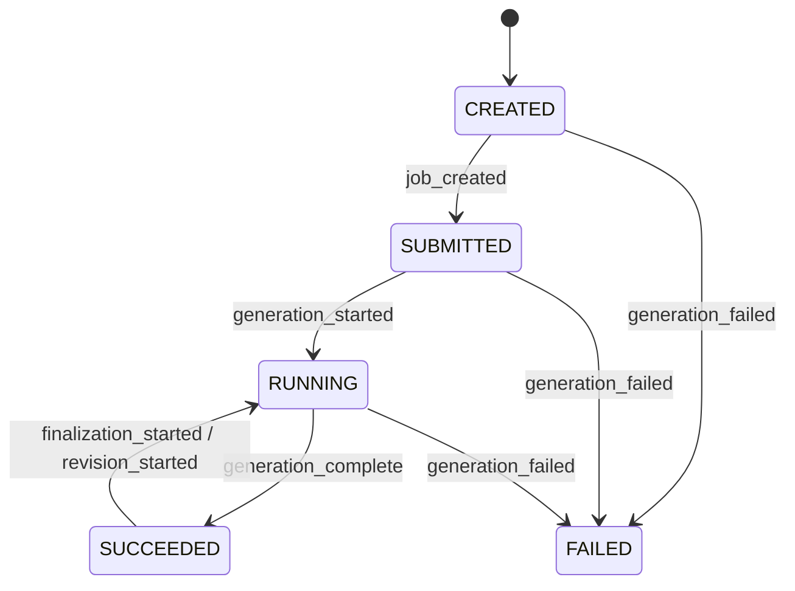
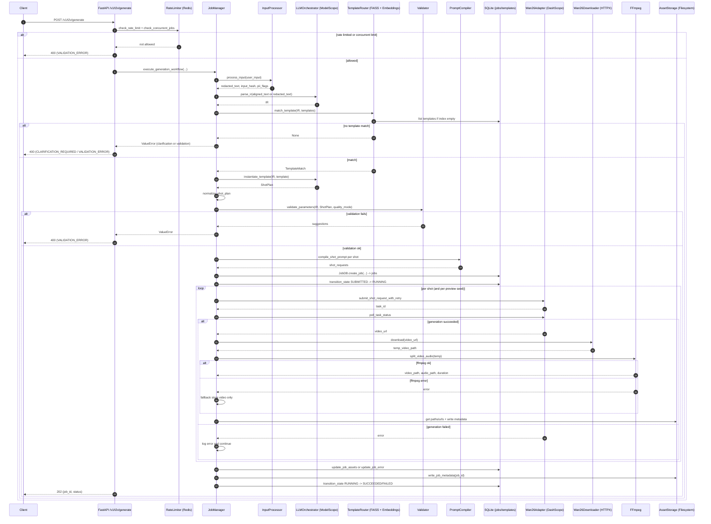
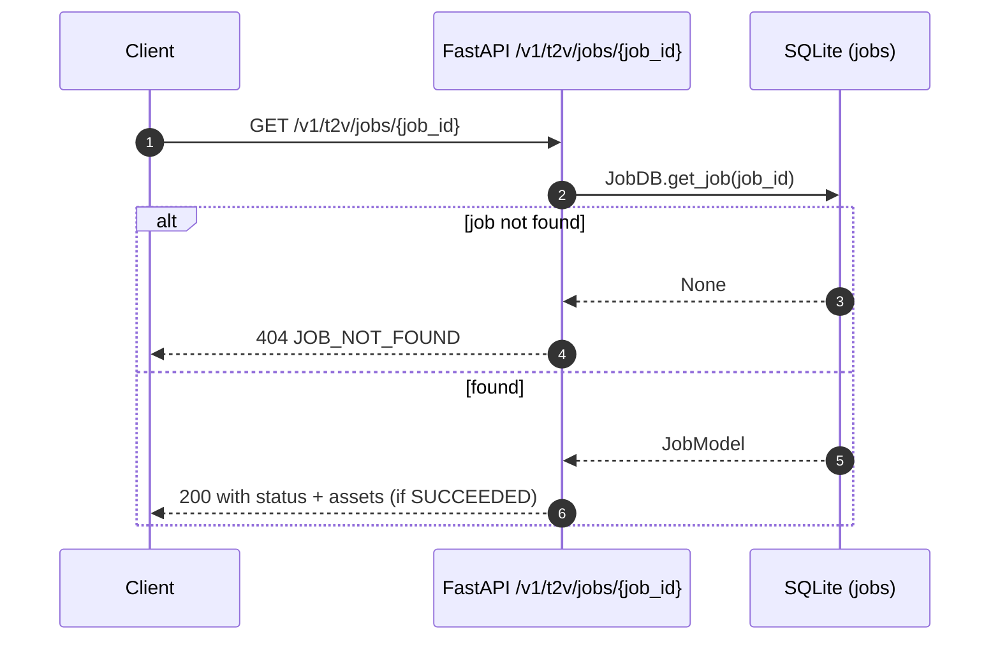
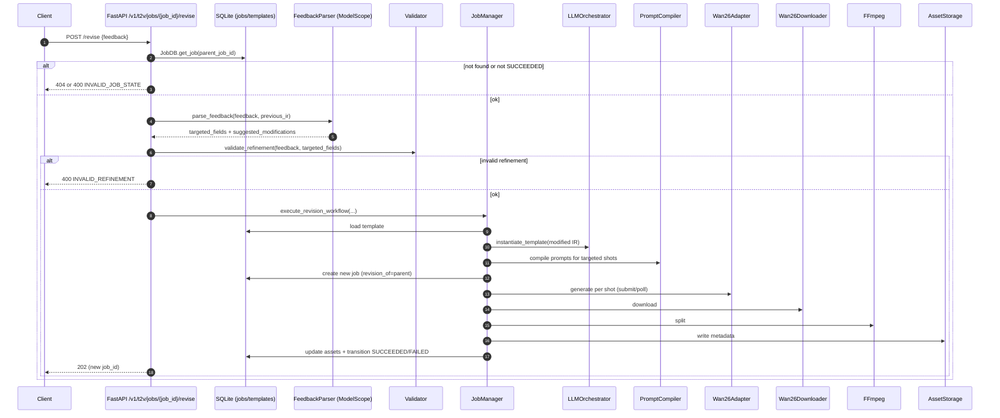
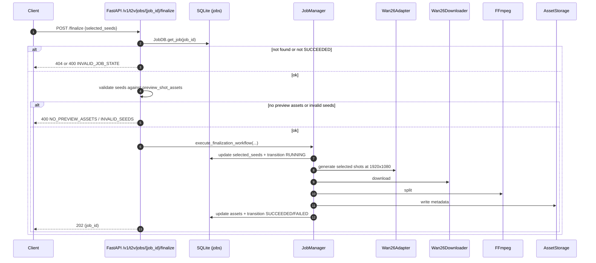

# Backend Data Flow (Input to Output)

This document describes the current backend data flow based on the FastAPI service
implementation. It includes sequence diagrams, flowcharts, data stores, external
dependencies, and error branches.

## Scope

- Primary flow: `POST /v1/t2v/generate` (text to video generation)
- Support flows: `GET /v1/t2v/jobs/{job_id}`, `POST /v1/t2v/jobs/{job_id}/revise`,
  `POST /v1/t2v/jobs/{job_id}/finalize`
- Data stores: `jobs` and `templates` tables, filesystem static assets
- External services: LLM, embeddings, DashScope video, Redis, ffmpeg

Note: `POST /v1/t2v/generate` executes the full workflow synchronously and returns
after generation completes, even though it returns HTTP 202.

## Data Stores

- SQLite database (default `sqlite:///./data/jobs.db`)
  - `jobs` table (see `backend/src/models/job.py`)
    - Inputs: `user_input_redacted`, `user_input_hash`, `pii_flags`
    - Pipeline: `ir`, `shot_plan`, `shot_requests`
    - Outputs: `shot_assets`, `preview_shot_assets`, `selected_seeds`, `resolution`,
      `total_duration_s`
    - Lifecycle: `state`, `state_transitions`, timestamps
    - Errors: `error_details`, retry fields
  - `templates` table (see `backend/src/models/template.py`)
    - `template_id`, `version`, `tags`, `constraints`, `shot_skeletons`,
      `negative_prompt_base`
- Filesystem static storage (default `/var/lib/prism/static`, fallback `./data`)
  - `videos/`, `audio/`, `metadata/` subdirs via `AssetStorage`

## External Dependencies

- ModelScope Qwen LLM (IR parsing, template instantiation, feedback parsing)
  - `LLMOrchestrator` and `FeedbackParser`
- DashScope embeddings (template semantic search)
  - `TemplateRouter` + FAISS index
- DashScope Wan2.6 text-to-video API
  - `Wan26RetryAdapter` submit/poll
- Redis
  - Rate limiting and concurrent job tracking
- HTTP download (httpx)
  - Download generated videos from DashScope URL
- ffmpeg/ffprobe
  - Split video into video-only and audio-only outputs

## State Transitions



## Sequence Diagram: Generate Flow



## Flowchart: Generate Pipeline (with Error Branches)

```mermaid
flowchart TD
    A[HTTP POST /v1/t2v/generate] --> B[Validate request fields]
    B --> C[Rate limit + concurrent limit (Redis)]
    C -->|blocked| C1[Return 400 VALIDATION_ERROR]
    C -->|allowed| D[InputProcessor: redact + detect + align]
    D --> E[LLM: parse IR]
    E --> F[TemplateRouter: match template]
    F -->|no match| F1[Return 400 CLARIFICATION_REQUIRED]
    F -->|match| G[LLM: instantiate template -> ShotPlan]
    G --> H[Validator: validate parameters]
    H -->|invalid| H1[Return 400 VALIDATION_ERROR]
    H -->|ok| I[PromptCompiler: compile per-shot prompts]
    I --> J[JobDB.create_job -> jobs table]
    J --> K[Transition SUBMITTED -> RUNNING]
    K --> L[Wan2.6: submit + poll]
    L -->|failed| L1[Log error, continue]
    L -->|succeeded| M[Download video (HTTPX)]
    M --> N[FFmpeg split video/audio]
    N -->|ffmpeg failed| N1[Store video only]
    N -->|ok| O[Store video+audio]
    N1 --> O
    O --> P[AssetStorage: URLs + metadata JSON]
    P --> Q[Update job assets + write metadata]
    Q --> R[Transition RUNNING -> SUCCEEDED/FAILED]
    R --> S[Return 202 + job_id]
```

## Sequence Diagram: Job Status Query



## Sequence Diagram: Revision Flow



## Sequence Diagram: Finalization Flow



## Asset Outputs

- Video URL: `/<static_prefix>/<video_subdir>/YYYY/MM/DD/{job_id}_shot_{shot_id}.mp4`
- Audio URL: `/<static_prefix>/<audio_subdir>/YYYY/MM/DD/{job_id}_shot_{shot_id}.mp3`
- Metadata URL: `/<static_prefix>/<metadata_subdir>/{job_id}.json`

Paths are generated by `AssetStorage` in `backend/src/services/asset_storage.py`.

## Error Handling (API Layer)

- Request validation failures are returned as 400 with `VALIDATION_ERROR`
  (`backend/src/api/main.py`).
- `ValueError` is mapped to 400 with `INVALID_VALUE`.
- Any unhandled exception becomes 500 with `INTERNAL_ERROR`.
